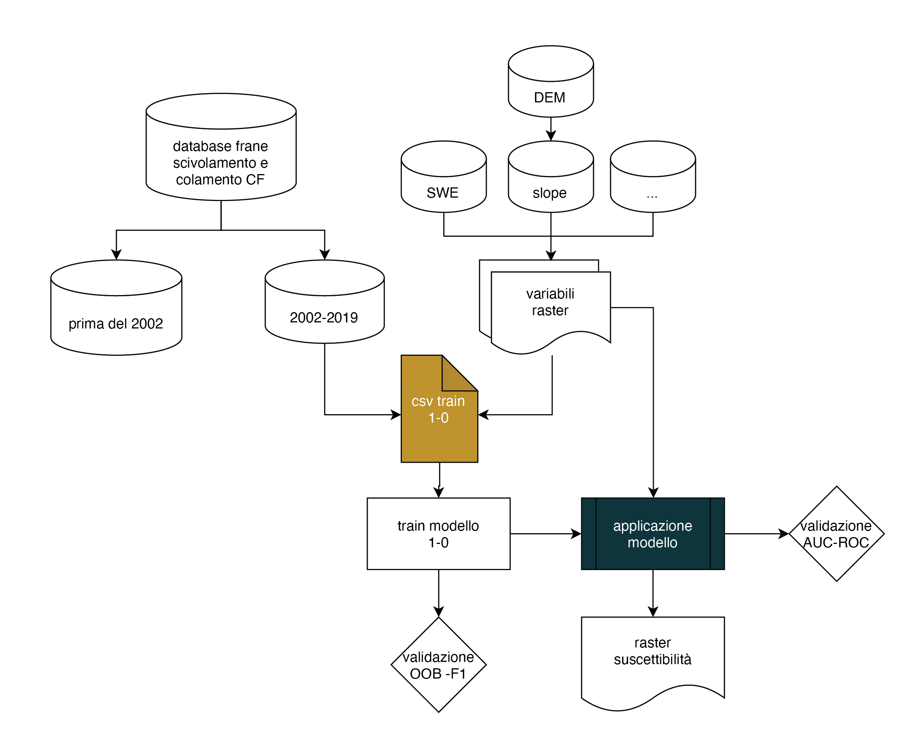
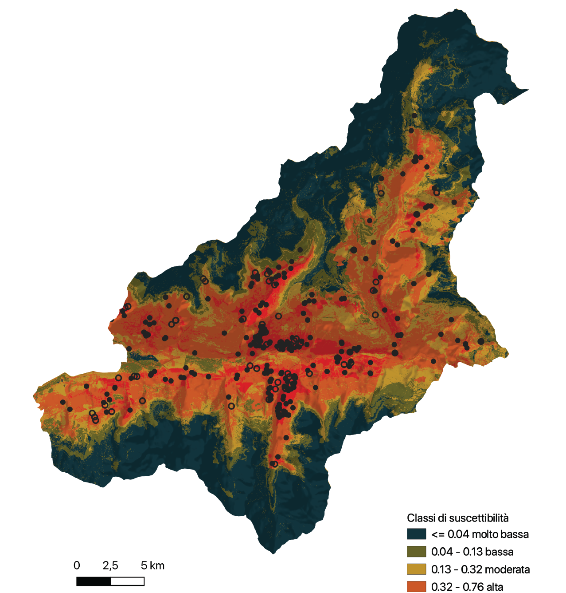

# Shallow landslide susceptibility analysis using Random Forest method in Val D'Aosta Valley
<a href="https://doi.org/10.1016/j.scitotenv.2021.147360"> 
	
</a>


 # :pushpin: Table of contents
<!--ts-->
* [About](#About)
* [Workflow](#Workflow)
* [Final product](#Finalproduct)
* [Cite](#Cite)
* [Resources](#Resources)
* [Data sources](#Datasources)
<!--te-->

# ℹ️ About
The aim of our study was to derive a susceptibility model adaptable to climate changes, through the inclusion of variables summarizing intense rainfall and snowmelt processes. We selected the territory of the Mont-Emilius and Mont-Cervin Mountain Communities (northern Italy) as study area. To define the summary variables, we investigated the relationships between landslide occurrences and meteorological events (reference period 1991-2020). For landslide susceptibility mapping, we set up a Generalized Additive Model. For model training, we extracted from the local inventory 298 dated landslide points and we selected 300 random non-landslide points. We defined a reference model through variable penalization (relief, NDVI, land cover and geology predictors).

# ↘️ Workflow




mergeVDA = quota [Digital Elevation Model (DEM) dal geoportale VDA]

slope = pendenza derivata dal DEM

aspect = esposizione del versante derivato dal DEM

curvatura = 


sumSWEabs = somma dei file  Snow Water Equivalent (SWE)

SWEmin = valori minimi di SWE entro bacini di accumulo


GEO = geologia classata
  
LAND = uso del suolo classato
  
# ⚙️ run v2
Shape of x,y train=> (575, 7)

Shape of x,y test=> (144, 7) 

RandomForestClassifier {'bootstrap': True, 'ccp_alpha': 0.0, 'class_weight': None, 'criterion': 'gini', 'max_depth': None, 'max_features': 'auto', 'max_leaf_nodes': None, 'max_samples': None, 'min_impurity_decrease': 0.0, 'min_impurity_split': None, 'min_samples_leaf': 1, 'min_samples_split': 2, 'min_weight_fraction_leaf': 0.0, 'n_estimators': 500, 'n_jobs': 4, 'oob_score': True, 'random_state': None, 'verbose': True, 'warm_start': False}

Training Set F1-Score=> 1.0 

Testing Set F1-Score=> 0.797

Final OOB error:0.202 

Best importance:

0.29, 'DEM 2'

0.24, 'sumSWEabs'

0.15, 'SLOPE'

0.11, 'SWEmin'

0.11, 'ASPECT'

0.07, 'land cover'

0.04, 'GEO'


-OOb error graph


-500x500 probability of landslide map-

# ⚙️ run v1
RandomForestClassifier {'bootstrap': True, 'ccp_alpha': 0.0, 'class_weight': None, 'criterion': 'gini', 
                      'max_depth': None, 'max_features': 'auto', 'max_leaf_nodes': None, 'max_samples': None, 
                      'min_impurity_decrease': 0.0, 'min_impurity_split': None, 'min_samples_leaf': 1, 
                      'min_samples_split': 2, 'min_weight_fraction_leaf': 0.0, 'n_estimators': 5000, 
                      'n_jobs': 4, 'oob_score': True, 'random_state': None, 'verbose': True, 'warm_start': True}

estimators= 2000

Test accuracy:
1.0

Best importance scores:

0.31, 'mergeVDA'

0.24, 'sumSWEabs' 

0.19, 'slope' 

0.13, 'SWEmin' 

0.12, 'aspect'

Last OOB error:
0.195


# 🗺️ Final product


# 📃 Cite

Raffa, M., Camera, C.A.S., Bajni, G., 2020. Il ruolo della neve nell’innesco di frane superficiali valutato con random forest:  il caso del Mont Cervin e del Mont Emilius in Valle D’Aosta (Tesi di Laurea Magistrale in Geologia Applicata al Territorio, all’Ambiente e alle Risorse Idriche). Università degli Studi di Milano.

```sourceCode
@phdthesis{raffa_il_2020,
	type = {Tesi di Laurea Magistrale in Geologia Applicata al Territorio, all’Ambiente e alle Risorse Idriche},
	title = {Il ruolo della neve nell'innesco di frane superficiali valutato con random forest:  il caso del Mont Cervin e del Mont Emilius in Valle D'Aosta},
	language = {it},
	school = {Università degli Studi di Milano},
	author = {Raffa, Mattia and Camera, Corrado A. S. and Bajni, Greta},
	year = {2020}
}
```
Camera, C.A.S., Bajni, G., Corno, I., Raffa, M., Stevenazzi, S., Apuani, T., 2021. Introducing intense rainfall and snowmelt variables to implement a process-related non-stationary shallow landslide susceptibility analysis. Science of The Total Environment. https://doi.org/10.1016/j.scitotenv.2021.147360

```sourceCode
@article{camera_introducing_2021,
	title = {Introducing intense rainfall and snowmelt variables to implement a process-related non-stationary shallow landslide susceptibility analysis},
	issn = {0048-9697},
	url = {https://www.sciencedirect.com/science/article/pii/S0048969721024311},
	doi = {https://doi.org/10.1016/j.scitotenv.2021.147360},
	journal = {Science of The Total Environment},
	author = {Camera, Corrado A. S. and Bajni, Greta and Corno, Irene and Raffa, Mattia and Stevenazzi, Stefania and Apuani, Tiziana},
	year = {2021},
	keywords = {Aosta Valley, Climate variables, Flowslides, Generalized Additive Models, Slides in soil, Snow Water Equivalent}
}
 ```

# 📦 Resources
https://github.com/PAULGOYES/Landslide_RL_MLP_DNN

Para el uso debido de la información se recomienda usar la siguiente cita: P. Goyes-Peñafiel y A. Hernandez-Rojas (2020). Doble evaluación de la susceptibilidad por movimientos en masa basados en la solución del problema de clasificación con redes neuronales artificiales y Pesos de Evidencia. https://zenodo.org/badge/latestdoi/250913053

# 💾 Data sources
www.cf.regione.vda.it

www.catastodissesti.partout.it/#

www.mappe.regione.vda.it/pub/geodissesti

www.geologiavda.partout.it/GeoCartaGeo?l=it

www.geoportale.regione.vda.it/mappe/

www.arpa.vda.it/it
