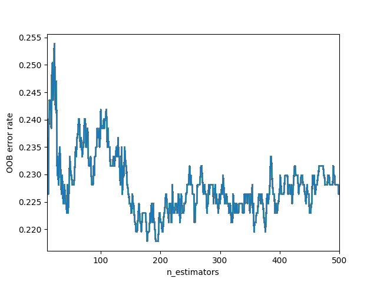

# Applicazione statistica del metodo Random Forest allo studio di suscettibilità da frane superficiali in terra nella regione Val D’Aosta

RandomForestClassifier {'bootstrap': True, 'ccp_alpha': 0.0, 'class_weight': None, 'criterion': 'gini', 
                      'max_depth': None, 'max_features': 'auto', 'max_leaf_nodes': None, 'max_samples': None, 
                      'min_impurity_decrease': 0.0, 'min_impurity_split': None, 'min_samples_leaf': 1, 
                      'min_samples_split': 2, 'min_weight_fraction_leaf': 0.0, 'n_estimators': 5000, 
                      'n_jobs': 4, 'oob_score': True, 'random_state': None, 'verbose': True, 'warm_start': True}

estimators= 2000

Test accuracy:
1.0

Best importance scores:
[(0.31, 'mergeVDA'), 
(0.24, 'sumSWEabs'), 
(0.19, 'slope'), 
(0.13, 'SWEmin'), 
(0.12, 'aspect')]

OOB error:
0.195

