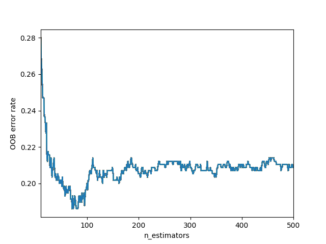
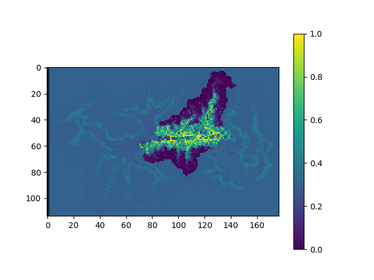
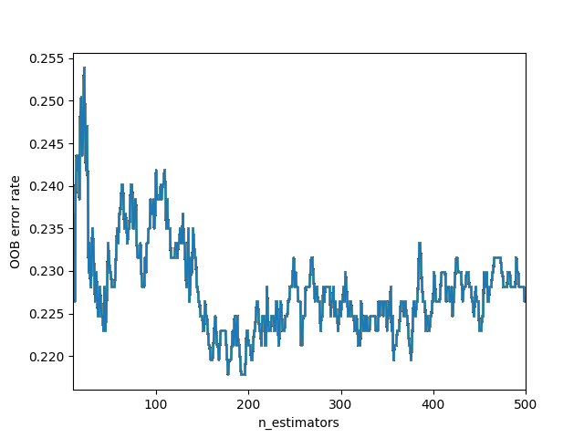

# Applicazione statistica del metodo Random Forest allo studio di suscettibilità da frane superficiali in terra nella regione Val D’Aosta

mergeVDA = quota [Digital Elevation Model (DEM) dal geoportale VDA]

slope = pendenza derivata dal DEM

aspect = esposizione del versante derivato dal DEM

curvatura = 

sumSWEabs = somma dei file  Snow Water Equivalent (SWE)

SWEmin = valori minimi di SWE entro bacini di accumulo

GEO = geologia classata
  
LAND = uso del suolo classato
  
# run v2
Shape of x,y train=> (575, 7)

Shape of x,y test=> (144, 7) 

RandomForestClassifier {'bootstrap': True, 'ccp_alpha': 0.0, 'class_weight': None, 'criterion': 'gini', 'max_depth': None, 'max_features': 'auto', 'max_leaf_nodes': None, 'max_samples': None, 'min_impurity_decrease': 0.0, 'min_impurity_split': None, 'min_samples_leaf': 1, 'min_samples_split': 2, 'min_weight_fraction_leaf': 0.0, 'n_estimators': 500, 'n_jobs': 4, 'oob_score': True, 'random_state': None, 'verbose': True, 'warm_start': False}

Training Set F1-Score=> 1.0 

Testing Set F1-Score=> 0.797

Final OOB error:0.202 

Best importance:

0.29, 'DEM 2'

0.24, 'sumSWEabs'

0.15, 'SLOPE'

0.11, 'SWEmin'

0.11, 'ASPECT'

0.07, 'land cover'

0.04, 'GEO'

# run v1
RandomForestClassifier {'bootstrap': True, 'ccp_alpha': 0.0, 'class_weight': None, 'criterion': 'gini', 
                      'max_depth': None, 'max_features': 'auto', 'max_leaf_nodes': None, 'max_samples': None, 
                      'min_impurity_decrease': 0.0, 'min_impurity_split': None, 'min_samples_leaf': 1, 
                      'min_samples_split': 2, 'min_weight_fraction_leaf': 0.0, 'n_estimators': 5000, 
                      'n_jobs': 4, 'oob_score': True, 'random_state': None, 'verbose': True, 'warm_start': True}

estimators= 2000

Test accuracy:
1.0

Best importance scores:

0.31, 'mergeVDA'

0.24, 'sumSWEabs' 

0.19, 'slope' 

0.13, 'SWEmin' 

0.12, 'aspect'

Last OOB error:
0.195

# data sources
cf.regione.vda.it

catastodissesti.partout.it/#

mappe.regione.vda.it/pub/geodissesti

geologiavda.partout.it/GeoCartaGeo?l=it

geoportale.regione.vda.it/mappe/

arpa.vda.it/it
